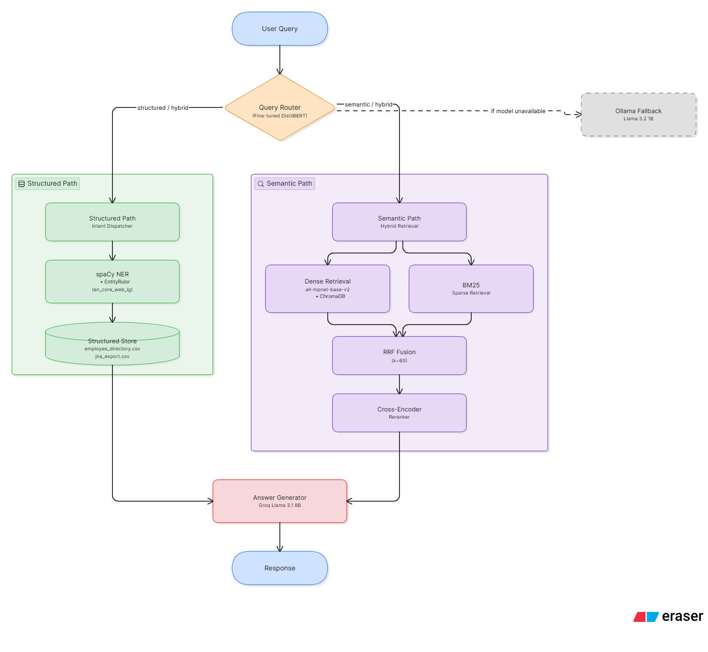

# Lumora Analytics - Hybrid Enterprise RAG System

A production-grade **Hybrid Retrieval-Augmented Generation (RAG)** system combining structured and unstructured data with ML-powered routing.

## Features

- **Structured Query Engine**: Employee directory & Jira tickets using pandas
- **Semantic Search**: Vector embeddings + ChromaDB
- **Hybrid Retrieval**: BM25 + Dense + Cross-encoder reranking
- **ML Router**: Fine-tuned **DistilBERT** for query classification
- **Local LLM**: Ollama (llama3.2:1b) with citations
- **Beautiful UI**: Streamlit Chat Interface
- **SpaCy NER**: Robust name/entity extraction

## Tech Stack

- **Backend**: FastAPI + Streamlit
- **Vector DB**: ChromaDB
- **ML**: Hugging Face, DistilBERT (fine-tuned), SpaCy
- **LLM**: Ollama (llama3.2:1b)

## Architecture



## How to Run

### 1. Create virtual environment

```bash
python -m venv venv

source venv/bin/activate        # Mac/Linux
venv\Scripts\activate           # Windows
```

### 2. Install dependencies

```bash
pip install -r requirements.txt
python -m spacy download en_core_web_lg
```

### 3. Create `.env` file

```
GROQ_API_KEY=your_groq_api_key_here
```

Get your free key at [console.groq.com](https://console.groq.com).

### 4. Set up Ollama

**Local:**
```bash
ollama pull llama3.2:1b
ollama serve
```

**Docker:**
```bash
docker run -d -p 11434:11434 --name ollama ollama/ollama
docker exec -it ollama ollama pull llama3.2:1b
```

### 5. Ingest documents

```bash
python src/retrieval/unstructured_ingest_v1.py
```

### 6. Train the query classifier

```bash
python src/models/query_classifier.py
```

### 7. Launch

```bash
# Streamlit UI
streamlit run app/streamlit_app.py       # → http://localhost:8501

# FastAPI
uvicorn app.main:app --reload            # → http://localhost:8000

# CLI
python demo.py
```

### 8. Run evaluation harness (optional)

```bash
python evaluation_harness.py
```
